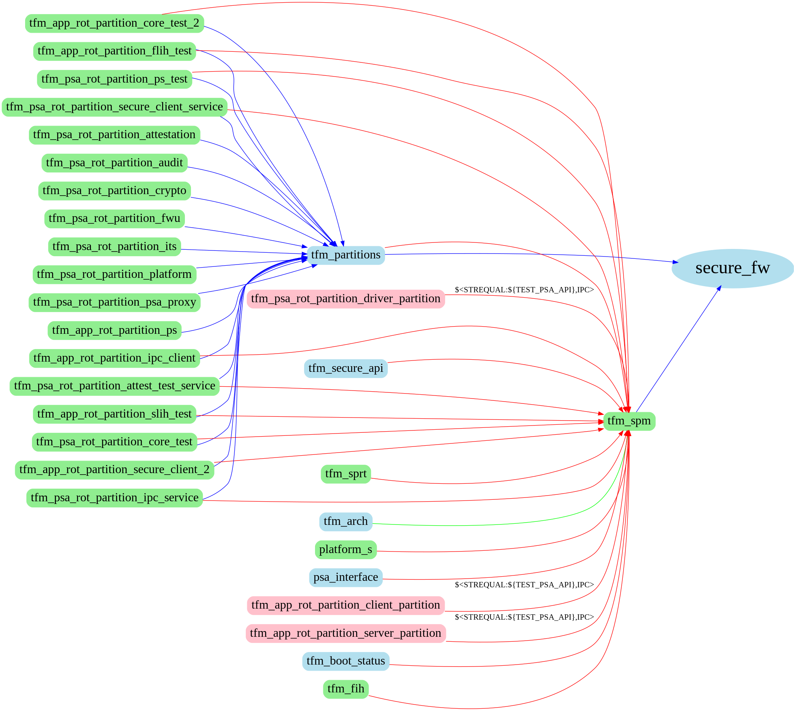
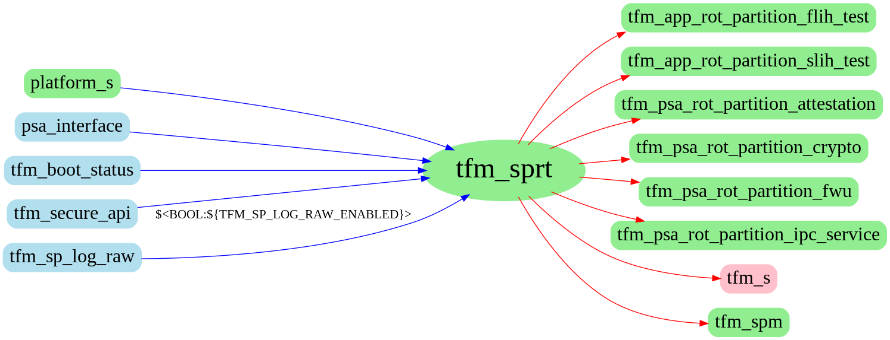

#############################
Library dependency trace tool
#############################

.. contents:: Table of Contents

This is a script to search a specific library's dependencies, including linked
libraries, source files, include paths and some other information about it.

****************
Install graphviz
****************

Linux
=====
Install graphviz to generate diagram of dependencies.

.. code-block:: bash

    sudo apt install graphviz # via Ubuntu package management
    pip install graphviz # via Python package installer

Windows
=======

In windows, graphviz is also needed and moreover, it is required to install the
software with same name. It can be downloaded from
`graphviz <https://graphviz.org/download/>`__. Note that it shall be added
into system path of Windows.

*****
Usage
*****

The command is:

.. code-block:: bash

    python3 lib_trace.py -l <library_name>
                         -p <repo_path_1,repo_path_2,...>
                         -d <max depth>
                         -i # only draw input dependent libraries
                         -o # only draw output dependent libraries
                         -h # help

It is required to input library name and repo paths, and at least one of ``-o``
or ``-i``. The default max depth of graph is 1. The output files are
``<library>.png``, ``<library>.log`` and ``<library>.txt``. The
``<library>.png`` shows the relationship of the specific library. The
``<library>.log`` gives the information of the library with JSON format. The
``<library>.txt`` gives plain text format of the information.

Dependency trace output diagram
===============================

.. code-block:: bash

    python3 lib_trace.py -p '<tf-m-path>,<tf-m-tests-path>' \
    -l secure_fw -d 2 -i

   Library secure_fw's dependent libraries

From the piture we can see the input dependent libraries of ``secure_fw``. The
edges in the diagram show like:

.. code-block:: bash

     ------          condition           ------
    |source|  ---------------------->   |target|
     ------                              ------

In CMAKE, it means:

.. code-block:: CMAKE

    target_link_libraries(target
        PUBLIC|PRIVATE|INTERFACE
            <condition> : source
    )

Different CMAKE link key word shows different edge color:

+----------------------+-------------+
| CMAKE link key words | Edge Colors |
+======================+=============+
| PUBLIC               | Green       |
+----------------------+-------------+
| PRIVATE              | Red         |
+----------------------+-------------+
| INTERFACE            | Blue        |
+----------------------+-------------+

Different node of library or target has different color:

+-----------------------+-------------+
| Node meaning          | Node Colors |
+=======================+=============+
| Static library        | Green       |
+-----------------------+-------------+
| Interface library     | Light blue  |
+-----------------------+-------------+
| Unkown from workspace | Pink        |
+-----------------------+-------------+

.. Note::
    The pink node is an exception, it can be a static, interface library. It can
    be an executable target in CMAKE as well. This tool cannot locate where it
    is created if the workspace isn't added into the list of imput paths.

Another diagram of ``tfm_sprt`` shows:

.. code-block:: bash

    python3 lib_trace.py -p '<tf-m-path>,<tf-m-tests-path>' \
    -l tfm_sprt -d 1 -i -o

   Library tfm_sprt's dependency trace

This picture shows the specific library's input and output dependencies.

Dependency trace output log
===========================

The log shows in two ways, a plain text or JSON file. The plain text is more
readable. The text behind ``<----`` is the condition if the source has.

.. code-block:: bash

    library name: library name

    source libraries:
        INTERFACE
            tfm_partitions
            tfm_spm

    destination libraries:
        PRIVATE
            tfm_app_rot_partition_ps
            tfm_psa_rot_partition_attestation
            tfm_psa_rot_partition_psa_proxy
            tfm_s

    include directories:
        INTERFACE
            /home/sjl/work/tf-m/secure_fw/include	<----	BUILD_INTERFACE
            /home/sjl/work/tf-m/secure_fw/partitions	<----	BUILD_INTERFACE

    source files:

    compiler definitions:

The JSON file is supplied for users to get formatted input.

.. code-block:: json

    {
        "library name": "secure_fw",
        "source library": {
            "PUBLIC": [],
            "PRIVATE": [],
            "INTERFACE": [
                {
                    "name": "tfm_partitions",
                    "condition": ""
                },
                {
                    "name": "tfm_spm",
                    "condition": ""
                }
            ]
        },
        "dst library": {
            "PUBLIC": [],
            "PRIVATE": [
                {
                    "name": "tfm_app_rot_partition_ps",
                    "condition": ""
                },
                {
                    "name": "tfm_psa_rot_partition_attestation",
                    "condition": ""
                },
                {
                    "name": "tfm_psa_rot_partition_psa_proxy",
                    "condition": ""
                },
                {
                    "name": "tfm_s",
                    "condition": ""
                }
            ],
            "INTERFACE": []
        },
        "include": {
            "PUBLIC": [],
            "PRIVATE": [],
            "INTERFACE": [
                {
                    "name": "/home/sjl/work/tf-m/secure_fw/include",
                    "condition": "BUILD_INTERFACE"
                },
                {
                    "name": "/home/sjl/work/tf-m/secure_fw/partitions",
                    "condition": "BUILD_INTERFACE"
                }
            ]
        },
        "source": {
            "PUBLIC": [],
            "PRIVATE": [],
            "INTERFACE": []
        },
        "compile definition": {
            "PUBLIC": [],
            "PRIVATE": [],
            "INTERFACE": []
        }
    }

--------------

*Copyright (c) 2021, Arm Limited. All rights reserved.*
